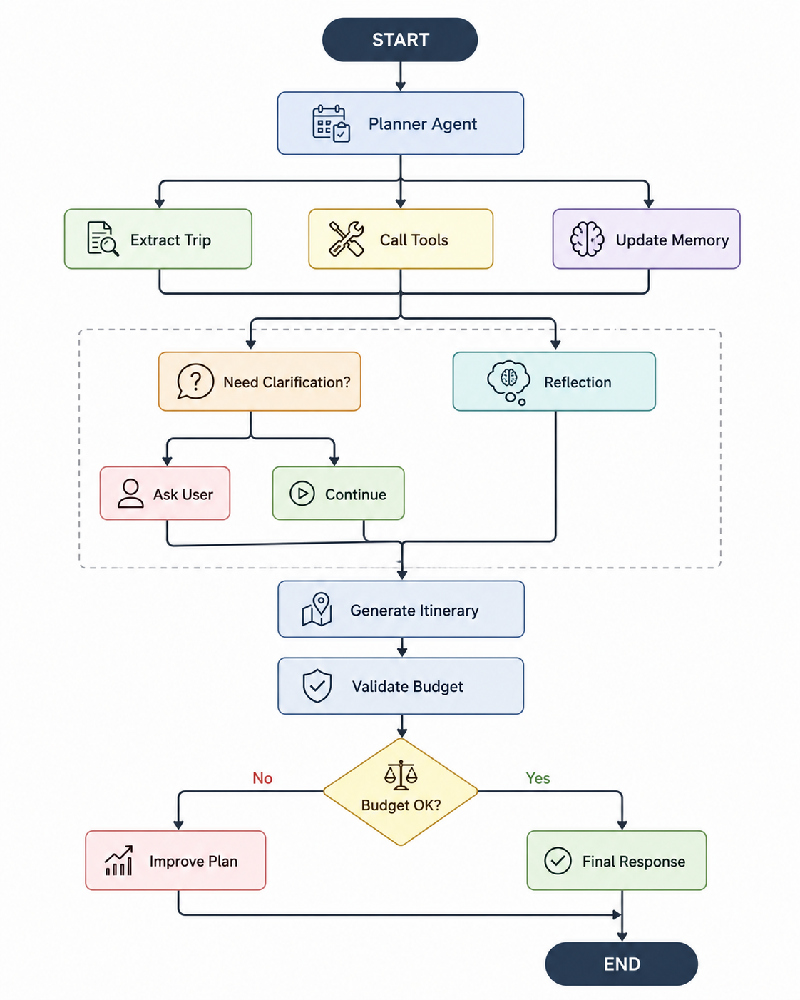
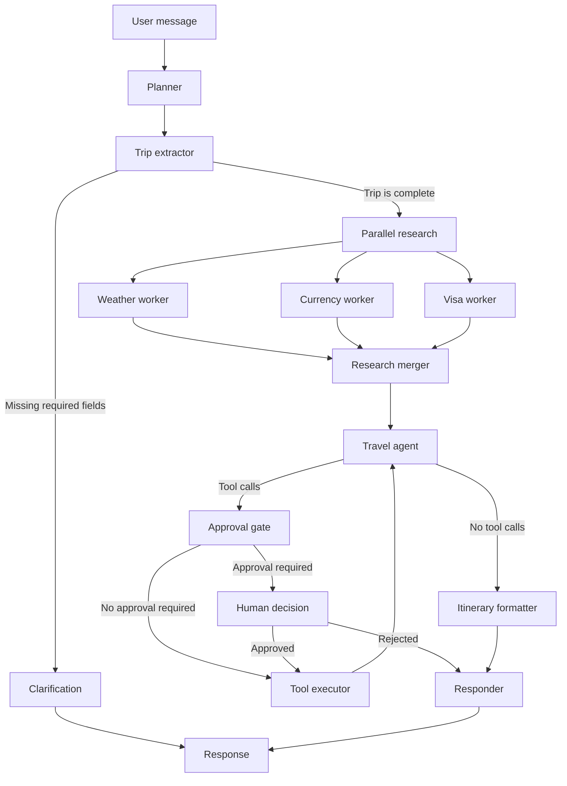

# Travel AI Agent

An AI-assisted travel planning workspace built with **FastAPI**, **LangGraph**, **Groq**, and **Next.js**. The application turns a conversational trip request into structured trip data, asks for missing details, gathers destination context in parallel, and produces a day-by-day itinerary with practical and budget notes.

The repository contains both the Python API and a browser client for regular chat, server-sent event streaming, thread continuation, and human approval workflows.



## Table of Contents

- [Highlights](#highlights)
- [How It Works](#how-it-works)
- [Technology](#technology)
- [Project Layout](#project-layout)
- [Prerequisites](#prerequisites)
- [Quick Start](#quick-start)
- [Configuration](#configuration)
- [API](#api)
- [Tools and Data](#tools-and-data)
- [Conversation State](#conversation-state)
- [Development](#development)
- [Troubleshooting](#troubleshooting)
- [Current Limitations](#current-limitations)
- [License](#license)

## Highlights

- Stateful, multi-turn travel conversations identified by a `thread_id`
- Structured extraction of destination, origin, dates, duration, budget, travelers, and preferences
- Clarification prompts when destination, duration, or budget is missing
- Parallel weather, currency, and visa research through a LangGraph subgraph
- Day-by-day itinerary generation with a normalized trip length
- Budget normalization to USD using the Frankfurter exchange-rate API
- Groq-powered structured output and tool calling
- Human-in-the-loop interruption and resume endpoints for sensitive actions
- Standard JSON chat and server-sent event streaming APIs
- Next.js interface with stream modes, live graph events, and approval controls
- Built-in FastAPI OpenAPI documentation and structured runtime logging

## How It Works



Each new request gets a UUID unless the client supplies an existing `thread_id`. LangGraph's in-memory checkpointer uses that ID to restore the conversation and extracted trip state on later turns.

## Technology

| Area | Technology |
| --- | --- |
| API | FastAPI, Uvicorn, Pydantic |
| Agent orchestration | LangGraph, LangChain |
| LLM provider | Groq via `langchain-groq` |
| Frontend | Next.js 16, React 19, TypeScript |
| Streaming | Server-sent events (SSE) |
| State | LangGraph `MemorySaver` |
| External data | Frankfurter currency-rate API |

## Project Layout

```text
.
|-- app/
|   |-- api/routes/          # Chat, stream, approval, and health endpoints
|   |-- graph/
|   |   |-- nodes/           # Main graph and research worker nodes
|   |   |-- prompts/         # LLM prompt templates
|   |   |-- routers/         # Conditional graph routing
|   |   |-- subgraphs/       # Parallel destination research graph
|   |   `-- builder.py       # Main LangGraph assembly
|   |-- llm/                 # Groq provider and tool binding
|   |-- models/              # Trip and itinerary data models
|   |-- schemas/             # Public API request/response models
|   |-- services/            # Graph invocation, SSE, and currency conversion
|   |-- tools/               # Agent-callable travel tools
|   `-- main.py              # FastAPI application
|-- frontend/
|   |-- app/                 # Next.js UI and styles
|   `-- lib/api.ts           # Typed API client and SSE parser
|-- docs/                    # Architecture assets
|-- requirements.txt
`-- README.md
```

## Prerequisites

- Python 3.11 or newer
- Node.js 20 or newer
- npm
- A [Groq API key](https://console.groq.com/keys)

## Quick Start

### 1. Set up the backend

From the repository root, create and activate a virtual environment:

```powershell
python -m venv venv
.\venv\Scripts\Activate.ps1
pip install -r requirements.txt
```

On macOS or Linux, activate it with:

```bash
python -m venv venv
source venv/bin/activate
pip install -r requirements.txt
```

Create `app/.env` with your Groq credentials:

```dotenv
GROQ_API_KEY=gsk_your_key_here
MODEL_NAME=llama-3.3-70b-versatile
TEMPERATURE=0.0
```

The `.env` file belongs inside the `app` directory, because that is the path configured in `app/config.py`.

Start the API:

```bash
uvicorn app.main:app --reload --host 127.0.0.1 --port 8000
```

Verify it at [http://127.0.0.1:8000/health](http://127.0.0.1:8000/health). Interactive API documentation is available at [http://127.0.0.1:8000/docs](http://127.0.0.1:8000/docs).

### 2. Set up the frontend

Open a second terminal:

```powershell
cd frontend
Copy-Item .env.local.example .env.local
npm install
npm run dev
```

On macOS or Linux, replace the copy command with:

```bash
cp .env.local.example .env.local
```

Open [http://localhost:3000](http://localhost:3000). The default frontend configuration connects to `http://localhost:8000`.

## Configuration

### Backend

Settings are loaded from environment variables and `app/.env`.

| Variable | Required | Default | Purpose |
| --- | --- | --- | --- |
| `GROQ_API_KEY` | Yes | None | Authenticates requests to Groq |
| `MODEL_NAME` | No | `llama-3.3-70b-versatile` | Groq chat model used by graph nodes |
| `TEMPERATURE` | No | `0.0` | Model sampling temperature |

Restart the backend after changing these values because settings and LLM clients are cached for the process lifetime.

### Frontend

| Variable | Required | Default | Purpose |
| --- | --- | --- | --- |
| `NEXT_PUBLIC_API_BASE_URL` | No | `http://localhost:8000` | Base URL of the FastAPI server |

The API currently allows browser requests from `localhost:3000` and `127.0.0.1:3000`. Update the CORS origins in `app/main.py` for other frontend hosts.

## API

### Health check

```http
GET /health
```

```json
{"status": "ok"}
```

### Send a message

```http
POST /chat
Content-Type: application/json
```

```json
{
  "message": "Plan a 7-day Japan trip from Bangladesh with a $2000 budget"
}
```

The response includes the generated thread ID:

```json
{
  "response": "...",
  "thread_id": "c2c00300-46a7-4ba0-bfa6-d91f30f4e162"
}
```

Send the same `thread_id` with follow-up messages to preserve context:

```json
{
  "message": "Add more temples, local food, and nature",
  "thread_id": "c2c00300-46a7-4ba0-bfa6-d91f30f4e162"
}
```

### Stream a message

```http
POST /chat/stream
Accept: text/event-stream
Content-Type: application/json
```

```json
{
  "message": "Plan a 5-day Thailand trip from Dhaka under $1200",
  "stream_mode": "messages"
}
```

Supported stream modes are `messages`, `updates`, and `debug`. The public SSE payload has this shape:

```json
{
  "event_type": "on_chat_model_stream",
  "node": "agent",
  "content": "...",
  "thread_id": "...",
  "timestamp": "2026-07-15T17:00:00+00:00"
}
```

The stream begins with `stream_start`, emits normalized LangGraph lifecycle and model events, and ends with `stream_end` or `stream_error`.

### Resume an approval

When a workflow is interrupted for approval, `/chat` returns `Approval required before continuing.` and the same thread ID. Resume it with:

```http
POST /chat/approve
Content-Type: application/json
```

```json
{
  "thread_id": "c2c00300-46a7-4ba0-bfa6-d91f30f4e162",
  "approved": true
}
```

```json
{
  "status": "accepted",
  "thread_id": "c2c00300-46a7-4ba0-bfa6-d91f30f4e162"
}
```

The approval endpoint resumes graph execution but returns only its status, not the resumed graph's final text.

## Tools and Data

The LLM can currently call three registered tools:

| Tool | Input | Behavior |
| --- | --- | --- |
| `weather` | Destination | Returns mock general weather guidance |
| `currency` | Country | Looks up a currency in a local mapping |
| `visa` | Destination and nationality | Returns general verification guidance |

The research subgraph independently builds static destination context for weather, currency, and visa topics. These results are useful for itinerary drafting, but they are not live travel advisories.

Budget conversion is the exception: when the extractor identifies a non-USD budget, the backend requests a current conversion rate from the public Frankfurter API and caches it for six hours. If the request fails, the original budget is retained without a fabricated conversion.

> [!CAUTION]
> Visa rules, weather, availability, and prices can change. Verify important travel decisions against official government, airline, hotel, and forecast sources before booking.

## Conversation State

The compiled graph currently uses LangGraph's `MemorySaver`:

- State survives follow-up requests only while the backend process is running.
- Restarting the API clears all conversation threads.
- State is local to one process, so multiple Uvicorn workers do not share threads.
- The SQLite and PostgreSQL checkpointer modules are placeholders and are not wired into the graph yet.

For production, replace `MemorySaver` in `app/graph/builder.py` with durable shared persistence and add an expiration policy for abandoned threads.

## Development

### Backend smoke test

The repository includes a direct Groq connectivity check. With `app/.env` configured and the virtual environment active, run:

```bash
python -m app.tests.api.test_groqapi
```

This invokes the configured model and prints a one-sentence response. It consumes a small amount of Groq quota and is not a mocked unit test.

### Frontend checks

```bash
cd frontend
npm run build
```

### Useful extension points

- Add agent tools in `app/tools/`, then register them in `app/llm/tools.py`.
- Add graph behavior in `app/graph/nodes/` and connect it in `app/graph/builder.py`.
- Expand structured trip fields in `app/models/trip.py` and update the extractor prompt.
- Replace static research workers in `app/graph/nodes/` with trusted live data providers.
- Implement a durable checkpointer in `app/graph/checkpointers/`.

## Troubleshooting

### `GROQ_API_KEY` field required

If `/chat` returns HTTP 500 and the backend logs a Pydantic validation error for `GROQ_API_KEY`, create `app/.env`, add the key, and restart Uvicorn. A root-level `.env` is not loaded by the current configuration.

### Frontend cannot reach the API

Confirm the backend is running on port `8000`, check `frontend/.env.local`, and restart Next.js after changing `NEXT_PUBLIC_API_BASE_URL`.

### A follow-up loses its context

Reuse the exact `thread_id` returned by the first request. Threads disappear when the backend restarts because persistence is currently in memory.

### Currency conversion is unavailable

The backend needs outbound HTTPS access to `api.frankfurter.dev`. Conversion failures are logged as warnings and do not stop itinerary generation.

## Current Limitations

- Weather, currency guidance, and visa guidance are static or mock data.
- No durable conversation persistence is enabled.
- No authentication or per-user thread ownership is implemented.
- The existing test is an integration smoke test; broad automated test coverage is still needed.
- Sensitive booking/payment tool names are recognized by the approval logic, but booking and payment tools are not currently registered.

## License

No license file is currently included. Add one before distributing or accepting external contributions.
