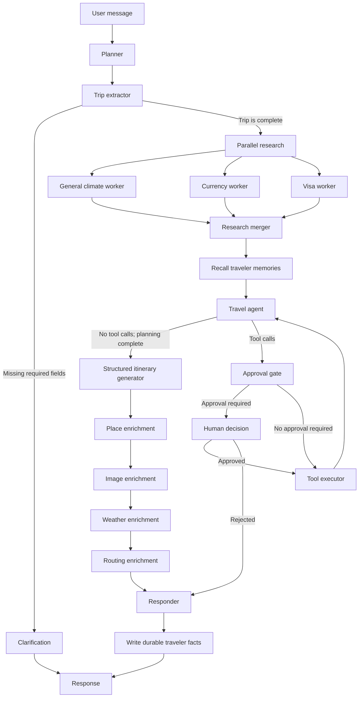

# Travel AI Agent

An AI-assisted travel planning workspace built with **FastAPI**, **LangGraph**, **Groq**, **Google Gemini**, and **Next.js**. The application turns a conversational trip request into structured trip data, asks for missing details, gathers destination context in parallel, and produces a day-by-day itinerary with practical and budget notes.

The repository contains both the Python API and a browser client for chat, thread continuation, and human approval workflows.

## Table of Contents

- [Live Demo](#live-demo)
- [Highlights](#highlights)
- [How It Works](#how-it-works)
- [Technology](#technology)
- [Project Layout](#project-layout)
- [Prerequisites](#prerequisites)
- [Quick Start](#quick-start)
- [Configuration](#configuration)
- [API](#api)
- [Tools and Data](#tools-and-data)
- [Conversation State](#conversation-state)
- [Development](#development)
- [Troubleshooting](#troubleshooting)
- [Current Limitations](#current-limitations)
- [License](#license)

## Live Demo

| Service | URL |
| --- | --- |
| Frontend | [https://travel-ai-fawn.vercel.app](https://travel-ai-fawn.vercel.app) |
| Backend API | [https://travelai-8b0i.onrender.com](https://travelai-8b0i.onrender.com) |
| API docs (Swagger) | [https://travelai-8b0i.onrender.com/docs](https://travelai-8b0i.onrender.com/docs) |

> [!NOTE]
> The backend runs on Render's free tier, which spins down after inactivity. The first request after a period of idleness may take up to a minute while the instance wakes up; the free-tier disk is also ephemeral, so conversation threads and Mem0 data reset on redeploy or restart (see [Conversation State](#conversation-state)).

## Highlights

- Stateful, multi-turn travel conversations identified by a `thread_id`
- Long-term traveler memory keyed by `user_id` through Mem0 and Qdrant
- Structured extraction of destination, origin, exact travel dates, budget, travelers, and preferences
- Date-picker clarification when exact dates are missing; `duration_days` is derived inclusively from `start_date` and `end_date`
- Clarification prompts when destination, dates, budget, origin, or traveler count is missing
- Parallel climate, currency, and visa research through a LangGraph subgraph
- Typed `TripPlan` itineraries with deterministic Markdown presentation
- Geoapify-backed resolution for attraction-like itinerary activities
- Wikidata and Wikimedia Commons attraction images with reuse metadata
- Leaflet itinerary maps using trusted Geoapify coordinates and map tiles
- Date-specific OpenWeather forecasts using trusted Geoapify coordinates
- Geoapify travel-time estimates between adjacent resolved itinerary activities
- Budget normalization to USD using the Frankfurter exchange-rate API
- Groq-powered extraction and clarification; Gemini-powered tool reasoning and final answers
- Human-in-the-loop interruption and resume endpoints for sensitive actions
- Standard JSON chat API
- Next.js interface with itinerary visualization and approval controls
- Built-in FastAPI OpenAPI documentation and structured runtime logging

## How It Works


```mermaid
flowchart TD
    A[User message] --> B[Planner]
    B --> C[Trip extractor]
    C -->|Missing required fields| D[Clarification]
    C -->|Trip is complete| E[Parallel research]
    E --> E1[General climate worker]
    E --> E2[Currency worker]
    E --> E3[Visa worker]
    E1 --> F[Research merger]
    E2 --> F
    E3 --> F
    F --> N[Recall traveler memories]
    N --> G[Travel agent]
    G -->|No tool calls; planning complete| P[Structured itinerary generator]
    G -->|Tool calls| I[Approval gate]
    I -->|Approval required| J[Human decision]
    I -->|No approval required| K[Tool executor]
    J -->|Approved| K
    J -->|Rejected| L[Responder]
    K --> G
    P --> Q[Place enrichment]
    Q --> R[Image enrichment]
    R --> W[Weather enrichment]
    W --> T[Routing enrichment]
    T --> L
    D --> M[Response]
    L --> O[Write durable traveler facts]
    O --> M
```

Each new request gets a UUID unless the client supplies an existing `thread_id`. LangGraph's SQLite checkpointer uses that ID to restore the conversation and extracted trip state on later turns.
When the client also supplies a stable `user_id`, Mem0 recalls and writes durable traveler facts across threads. Anonymous requests skip long-term personalization.

Complete itineraries now have a structured `TripPlan` representation as the
backend source of truth. The frontend renders completed plans as structured trip
overviews, day sections, attraction cards, budgets, and practical notes, while
clarification and general chat messages retain Markdown presentation. Geoapify enriches attraction-like
activities with provider-backed identity, addresses, and coordinates. Eligible,
fully resolved places are then matched conservatively to Wikidata entities;
their P18 claims are resolved through Wikimedia Commons into image URLs and
attribution-ready licensing metadata. Trusted attraction images render with
visible author, license, and Commons source attribution. The frontend plots only
fully resolved Geoapify coordinates on a Leaflet map backed by Geoapify tiles
and synchronizes markers with their itinerary cards. After image enrichment,
the backend uses one fully resolved Geoapify place per dated itinerary day to
request date-specific OpenWeather forecasts. The backend then requests
pair-by-pair Geoapify route estimates only between adjacent, fully resolved
same-day activities. Weather and routing enrichment never change the itinerary
plan or dates. Itinerary validation and replanning remain future work.

```text
final_response
      |
      +-- itinerary present --> TripItinerary
      |                         +-- trip overview
      |                         +-- trip map <--> activity cards
      |                         +-- day/activity cards
      |                         +-- budget and practical notes
      |
      +-- no itinerary -------> MarkdownContent
```

## Technology

| Area | Technology |
| --- | --- |
| API | FastAPI, Uvicorn, Pydantic |
| Agent orchestration | LangGraph, LangChain |
| LLM providers | Groq for extraction/clarification; Gemini for agent reasoning/final answers |
| Frontend | Next.js 16, React 19, TypeScript, Leaflet |
| State | LangGraph `AsyncSqliteSaver` (SQLite-backed checkpointer) |
| External data | Frankfurter currency-rate API, Geoapify, OpenWeather, Wikidata, Wikimedia Commons, OpenStreetMap |

## Project Layout

```text
.
|-- app/
|   |-- api/routes/          # Chat, approval, config, and health endpoints
|   |-- graph/
|   |   |-- nodes/           # Main graph and research worker nodes
|   |   |-- prompts/         # LLM prompt templates
|   |   |-- routers/         # Conditional graph routing
|   |   |-- subgraphs/       # Parallel destination research graph
|   |   `-- builder.py       # Main LangGraph assembly
|   |-- llm/                 # Role-specific Groq/Gemini providers and tool binding
|   |-- models/              # Structured trip data model
|   |-- schemas/             # Public API request/response models
|   |-- services/            # Graph, currency, and place enrichment services
|   |-- tools/               # Agent-callable travel tools
|   `-- main.py              # FastAPI application
|-- frontend/
|   |-- app/                 # Next.js UI and styles
|   `-- lib/api.ts           # Typed API client
|-- docs/                    # Architecture assets
|-- requirements.txt
`-- README.md
```

## Prerequisites

- Python 3.11 or newer
- Node.js 20 or newer
- npm
- Groq and Gemini API keys

## Quick Start

### 1. Set up the backend

From the repository root, create and activate a virtual environment:

```powershell
python -m venv venv
.\venv\Scripts\Activate.ps1
pip install -r requirements.txt
```

On macOS or Linux, activate it with:

```bash
python -m venv venv
source venv/bin/activate
pip install -r requirements.txt
```

Copy `app/.env.example` to `app/.env`, then add the provider credentials:

```dotenv
GEMINI_API_KEY=your_gemini_api_key_here
GEMINI_MODEL_NAME=gemini-2.5-flash-lite
GROQ_API_KEY=your_groq_api_key_here
GROQ_MODEL_NAME=openai/gpt-oss-20b
GEOAPIFY_API_KEY=your_geoapify_api_key_here
GEOAPIFY_MAPS_API_KEY=your_browser_restricted_geoapify_maps_key_here
WIKIMEDIA_USER_AGENT=TravelAI/1.0 (your product URL or support contact)
OPENWEATHER_API_KEY=your_openweather_api_key_here
TEMPERATURE=0.0
```

The `.env` file belongs inside the `app` directory, because that is the path configured in `app/config.py`.

Start the API:

```bash
uvicorn app.main:app --reload --host 127.0.0.1 --port 8000
```

Verify it at [http://127.0.0.1:8000/health](http://127.0.0.1:8000/health). Interactive API documentation is available at [http://127.0.0.1:8000/docs](http://127.0.0.1:8000/docs).

### 2. Set up the frontend

Open a second terminal:

```powershell
cd frontend
Copy-Item .env.local.example .env.local
npm install
npm run dev
```

On macOS or Linux, replace the copy command with:

```bash
cp .env.local.example .env.local
```

Open [http://localhost:3000](http://localhost:3000). The default frontend configuration connects to `http://localhost:8000`.

## Configuration

### Backend

Settings are loaded from environment variables and `app/.env`.

| Variable | Required | Default | Purpose |
| --- | --- | --- | --- |
| `GEMINI_API_KEY` | Yes | None | Authenticates requests to the Gemini Developer API (`GOOGLE_API_KEY` is also accepted) |
| `GEMINI_MODEL_NAME` | No | `gemini-2.5-flash-lite` | Gemini model used for tool reasoning and final answers |
| `GROQ_API_KEY` | Yes | None | Authenticates requests to the Groq API |
| `GROQ_MODEL_NAME` | No | `openai/gpt-oss-20b` | Groq model used for extraction, clarification, and memory fact extraction |
| `GEOAPIFY_API_KEY` | No | None | Private backend key for place resolution and adjacent-activity routing estimates; both enrichments degrade gracefully when unset |
| `GEOAPIFY_MAPS_API_KEY` | No | None | Separate browser-restricted key used only for Geoapify map tiles; maps are disabled when unset |
| `WIKIMEDIA_USER_AGENT` | No | None | Identifies this application to Wikimedia for image enrichment; it is not a secret, should include an appropriate product identity/contact, and enrichment is skipped when unset |
| `OPENWEATHER_API_KEY` | No | None | Private backend key for date-specific itinerary forecasts; enrichment is skipped when unset and the key is never returned to the browser |
| `TEMPERATURE` | No | `0.0` | Model sampling temperature |
| `CHECKPOINTER_SQLITE_PATH` | No | `app/.data/checkpoints.sqlite` | Disk path for the LangGraph SQLite checkpointer |
| `MEM0_VECTOR_STORE_PROVIDER` | No | `qdrant` | Mem0 vector store backend |
| `MEM0_VECTOR_STORE_PATH` | No | `app/.mem0/qdrant` | Local embedded Qdrant storage path |
| `MEM0_EMBEDDER_PROVIDER` | No | `fastembed` | Mem0 embedder provider for traveler memory search |
| `MEM0_EMBEDDER_MODEL` | No | `BAAI/bge-small-en-v1.5` | FastEmbed model used by Mem0 |
| `MEM0_EMBEDDING_DIMS` | No | `384` | Vector dimension for the configured embedding model |
| `CORS_ALLOWED_ORIGINS` | No | `http://localhost:3000,http://127.0.0.1:3000` | Comma-separated frontend origins allowed to call the API |

Restart the backend after changing these values because settings and LLM clients are cached for the process lifetime.

### Frontend

| Variable | Required | Default | Purpose |
| --- | --- | --- | --- |
| `NEXT_PUBLIC_API_BASE_URL` | No | `http://localhost:8000` | Base URL of the FastAPI server |

The deployed frontend at [travel-ai-fawn.vercel.app](https://travel-ai-fawn.vercel.app) points `NEXT_PUBLIC_API_BASE_URL` at the live Render backend. The API currently allows browser requests from that origin plus `localhost:3000` and `127.0.0.1:3000`; update `CORS_ALLOWED_ORIGINS` (or the CORS setup in `app/main.py`) for other frontend hosts.

### Itinerary map setup

1. In Geoapify MyProjects, create a separate key for browser map tiles.
2. Restrict it to the approved HTTP referrers, origins, and CORS settings for
   your frontend, such as `http://localhost:3000` during development.
3. Set `GEOAPIFY_MAPS_API_KEY` in `app/.env`, then restart the backend.

The browser map-tile key is intentionally visible in tile requests, so its
origin restrictions are required. The backend-only `GEOAPIFY_API_KEY` remains
private and is never returned to the frontend. No Map ID or Google API key is
needed, and Phase 5 makes no routing calls.

## API

### Health check

```http
GET /health
```

```json
{"status": "ok"}
```

### Public map configuration

```http
GET /config/maps
```

This endpoint returns only the browser-restricted Geoapify map-tile key when it
is configured, otherwise it returns `enabled: false` with a null value.
Responses use `Cache-Control: no-store`; no other application secrets are
exposed.

### Send a message

```http
POST /chat
Content-Type: application/json
```

```json
{
  "message": "Plan a 7-day Japan trip from Bangladesh with a $2000 budget",
  "user_id": "traveler-123"
}
```

The response includes the generated thread ID:

```json
{
  "response": "...",
  "thread_id": "c2c00300-46a7-4ba0-bfa6-d91f30f4e162",
  "itinerary": {
    "title": "7-Day Japan Itinerary",
    "destination": "Japan",
    "duration_days": 7,
    "days": []
  }
}
```

Send the same `thread_id` with follow-up messages to preserve context:

```json
{
  "message": "Add more temples, local food, and nature",
  "thread_id": "c2c00300-46a7-4ba0-bfa6-d91f30f4e162",
  "user_id": "traveler-123"
}
```

`thread_id` restores the current conversation. `user_id` enables long-term traveler memory across conversations. If `user_id` is omitted, memory recall and writes are skipped and the chat still works normally.

### Resume an approval

When a workflow is interrupted for approval, `/chat` returns `Approval required before continuing.` and the same thread ID. Resume it with:

```http
POST /chat/approve
Content-Type: application/json
```

```json
{
  "thread_id": "c2c00300-46a7-4ba0-bfa6-d91f30f4e162",
  "approved": true
}
```

```json
{
  "status": "accepted",
  "thread_id": "c2c00300-46a7-4ba0-bfa6-d91f30f4e162"
}
```

The approval endpoint resumes graph execution but returns only its status, not the resumed graph's final text.

## Tools and Data

The LLM can currently call three registered tools:

| Tool | Input | Behavior |
| --- | --- | --- |
| `weather` | Destination | Returns static general climate guidance, not a date-specific forecast |
| `currency` | Country | Looks up a currency in a local mapping |
| `visa` | Destination and nationality | Returns general verification guidance |

The research subgraph independently builds static destination context for
climate, currency, and visa topics. This climate context is useful for itinerary
drafting but is explicitly labeled as general guidance, not a date-specific
forecast. Real forecast data is added later by deterministic server-side
enrichment and does not involve a new LLM call.

Budget conversion is the exception: when the extractor identifies a non-USD budget, the backend requests a current conversion rate from the public Frankfurter API and caches it for six hours. If the request fails, the original budget is retained without a fabricated conversion.

Geoapify forward geocoding resolves generated itinerary activities to real
provider-backed places, addresses, and coordinates. Resolution failures degrade
gracefully and leave individual activities usable but marked unresolved. Obvious
transport, accommodation, meal, and logistics activities are skipped because
they are not attraction-like places. A trip-local circuit stops remaining calls
after authentication, persistent rate-limit, or provider-outage failures.

For fully resolved attraction-like places, enrichment retains a valid Wikidata
QID exposed by Geoapify/OpenStreetMap and uses that stable identity directly.
When no QID is available, Wikidata falls back to conservative matching using
normalized landmark aliases, coordinates, P17 country when available, and
location/description context. Wikimedia Commons first tries the entity's P18
image and then supported reusable visual image files from its P373 Commons
category. Commons supplies the file URL, an approximately 800px thumbnail URL,
source page, dimensions,
author/credit, license, and deterministic attribution text. Unknown, missing,
non-commercial, or otherwise unsupported license metadata causes the image to
be skipped rather than guessed. CC BY and CC BY-SA images also require an author
and a valid provider-supplied license URL. Image lookups use request-local
deduplication, bounded retries/concurrency, and a trip-local outage circuit.
`WIKIMEDIA_USER_AGENT` is not an API key or secret, but Wikimedia requires a
descriptive application identity with an appropriate contact method.

For each dated itinerary day, weather enrichment selects one fully resolved
Geoapify place, preferring a place in the day's city. Requests for the same city
and country are deduplicated, and OpenWeather's location timezone is used to
group 3-hour forecast entries by local calendar date. Daily values use the
minimum and maximum temperatures, maximum precipitation probability and wind
speed, and the condition nearest local noon. Days beyond the provider horizon
are marked separately from temporary provider failures. Missing configuration,
malformed responses, rate limits, and provider outages degrade gracefully and
never block itinerary delivery or trigger replanning. The
`OPENWEATHER_API_KEY` remains server-side; only typed daily forecast fields are
serialized to the frontend.

Weather-aware activity changes and replanning are not implemented in this
phase; forecasts are informational enrichment only.

After weather enrichment, Geoapify Routing estimates distance and duration for
adjacent activities whose places both have trusted Geoapify coordinates. An
explicit planning mode (`walk`, `drive`, `transit`, or `bicycle`) is preferred;
otherwise trips up to 1.5 km straight-line distance use walking and longer
trips use driving. Transit is never inferred. Same-place pairs are omitted, and
unresolved logistics break adjacency so routing never skips over an activity.
Requests are pair-by-pair, request-locally deduplicated, paced for the free API
tier, limited to two concurrent calls and capped at 20 unique calls per trip.
Authentication failures, rate limits, malformed responses, and provider
outages produce graceful unavailable legs without blocking itinerary delivery.
Only typed distance and duration values are retained; provider responses and
route geometry are not stored.

Completed plans use the structured itinerary UI, including rich image cards,
resolved place cards without images, compact logistics activities, budget
visibility, practical notes, readable Wikimedia attribution, and a lazily loaded
Leaflet map. The map consumes existing Geoapify coordinates without additional
geocoding or place-search calls. Its numbered markers and activity-card actions
share stable per-itinerary identities for two-way selection. Dated days display
compact OpenWeather forecasts when available, with visible provider attribution.
Resolved travel legs appear between their corresponding activity cards with
visible Geoapify and OpenStreetMap attribution. Estimates do not include live
traffic. Markdown remains the fallback for clarification and other
non-itinerary messages. Route geometry and turn-by-turn directions are not
implemented.

```text
TripPlan
  |-- TripMap --> Leaflet + Geoapify/OpenStreetMap tiles
  |                  ^
  |             Geoapify coordinates
  +-- itinerary cards
  |       +-- adjacent travel legs --> Geoapify Routing estimates
          ^   |
          +---+ selection synchronization
```

> [!CAUTION]
> Visa rules, weather, availability, and prices can change. Verify important travel decisions against official government, airline, hotel, and forecast sources before booking.

## Conversation State

The compiled graph uses LangGraph's `AsyncSqliteSaver`, writing checkpoints to a SQLite file on disk instead of keeping them in an in-memory dict:

- State survives follow-up requests for as long as the SQLite file exists.
- The checkpointer is built lazily on first use (it needs a running event loop) and cached as a singleton for the life of the process, so repeated requests reuse the same connection instead of reopening it.
- On Render's free tier the filesystem is ephemeral, so a redeploy or instance restart still clears conversation threads, exactly as it did under the old in-memory `MemorySaver` — the difference is that within a single running instance, memory usage no longer grows with every new thread.
- State is local to one process, so multiple Uvicorn workers do not share threads. Keep `WEB_CONCURRENCY`/worker count at 1 unless threads are moved to shared storage.
- A PostgreSQL checkpointer module is a placeholder and is not wired into the graph yet.

For production, point `CHECKPOINTER_SQLITE_PATH` at a persistent disk (a paid Render disk, or an external volume) or replace `AsyncSqliteSaver` in `app/graph/builder.py` with a durable shared backend (e.g. Postgres), and add an expiration policy for abandoned threads.

Long-term traveler facts are separate from the checkpointer. Mem0 stores durable preferences and constraints in Qdrant under `user_id`, so a returning traveler can be personalized even when they start a new `thread_id`. On the free-tier deployment, the local Qdrant path is subject to the same ephemeral-disk caveat above unless `MEM0_QDRANT_URL` is set to point at a remote Qdrant instance.

## Development

### Backend tests

With `app/.env` configured and the virtual environment active, run:

```bash
python -m pytest -q app/tests
```

Provider tests use mocked HTTP transports and do not call Geoapify, OpenWeather,
Wikidata, or Wikimedia Commons.

### Frontend checks

```bash
cd frontend
npm run build
```

### Useful extension points

- Add agent tools in `app/tools/`, then register them in `app/llm/tools.py`.
- Add graph behavior in `app/graph/nodes/` and connect it in `app/graph/builder.py`.
- Expand structured trip fields in `app/models/trip.py` and update the extractor prompt.
- Replace static research workers in `app/graph/nodes/` with trusted live data providers.
- Implement a durable, persistent-disk-backed checkpointer in `app/graph/checkpointers/` for production use.

## Troubleshooting

### Provider API key field required

If `/chat` returns HTTP 500 with a validation error for `GEMINI_API_KEY` or `GROQ_API_KEY`, add both keys to `app/.env` and restart Uvicorn. `GOOGLE_API_KEY` is accepted as an alternative Gemini variable name. A root-level `.env` is not loaded.

### Frontend cannot reach the API

Confirm the backend is running on port `8000` locally (or that the deployed backend is awake, if using the live Render URL), check `frontend/.env.local` / `NEXT_PUBLIC_API_BASE_URL`, and restart Next.js after changing it.

### A follow-up loses its context

Reuse the exact `thread_id` returned by the first request. Threads disappear when the backend's SQLite file is cleared, which happens on every redeploy/restart on Render's free tier since its disk is ephemeral.

### `NotImplementedError: The SqliteSaver does not support async methods`

This means the graph was compiled with the sync `SqliteSaver` while being invoked through async methods (`ainvoke`/`aget_state`). Use `AsyncSqliteSaver` from `langgraph.checkpoint.sqlite.aio` instead, built lazily after the event loop starts — see `app/graph/builder.py`.

### Currency conversion is unavailable

The backend needs outbound HTTPS access to `api.frankfurter.dev`. Conversion failures are logged as warnings and do not stop itinerary generation.

## Current Limitations

- General climate, currency, and visa research remains static guidance; date-specific weather uses OpenWeather only within its available forecast horizon.
- Conversation persistence is disk-backed but not durable across redeploys on ephemeral hosting (see [Conversation State](#conversation-state)).
- No authentication or per-user thread ownership is implemented.
- Place eligibility currently uses deterministic category/name heuristics rather than a dedicated typed activity taxonomy.
- Geoapify place and routing deduplication/circuit state are request-local; there is no persistent provider cache.
- Wikimedia image matching is intentionally conservative, has no generic image-search fallback, and may leave valid attractions without images.
- The itinerary map remains visualization-only: routing estimates are card-only and do not include geometry, live traffic, turn-by-turn directions, or route-aware replanning.
- Sensitive booking/payment tool names are recognized by the approval logic, but booking and payment tools are not currently registered.
- The backend's Render free-tier instance spins down when idle, adding cold-start latency to the first request after inactivity.
